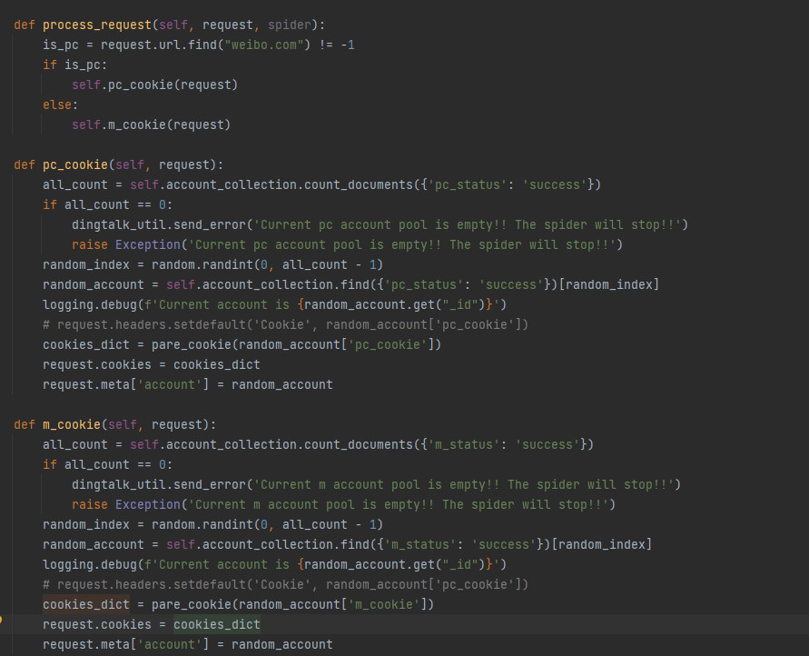

# 微博数据下载
本项目是大规模爬取新浪微博数据去除敏感信息的版本，仅供学习。
爬取微博数据信息2b，每台机器爬取数据400条
## 使用的接口
1. 微博 https://m.weibo.cn/api/container/getIndex?uid={uid}&type=uid&page={page}&containerid=107603{uid
2. 感兴趣标签 https://m.weibo.cn/api/attentionvist?uid={user_id
3. 感兴趣标签成员 https://m.weibo.cn/api/attentionvist/groupsMembersByTag?to_uid={user_id}&tag_id={tag_id}&page=1&count=200&trim_status=0
4. 点赞 https://m.weibo.cn/api/attitudes/show?id=4767284671286106&page=1
5. 用户（很多接口都有用户信息，取聚合，详情看代码） https://weibo.com/ajax/profile/detail?uid=1554226303
6. 评论 https://m.weibo.cn/comments/hotflow?id={id}&mid={id}&max_id_type=0&max_id={max_id
7. 转发 https://m.weibo.cn/api/statuses/repostTimeline?id=4767284671286106&page=301

## 架构设计
### 使用语言python 3.10
### 爬虫框架：scrapy

crapy 是一个基于 Twisted 的异步处理框架，是纯 Python 实现的爬虫框架，其架构清晰，模块之间的耦合程度低，可扩展性极强，可以灵活完成各种需求。我们只需要定制开发几个模块就可以轻松实现一个爬虫。

它可以分为如下的几个部分。
1. Engine，引擎，用来处理整个系统的数据流处理，触发事务，是整个框架的核心。
2. Item，项目，它定义了爬取结果的数据结构，爬取的数据会被赋值成该对象。
3. Scheduler， 调度器，用来接受引擎发过来的请求并加入队列中，并在引擎再次请求的时候提供给引擎。
4. Downloader，下载器，用于下载网页内容，并将网页内容返回给蜘蛛。
5. Spiders，蜘蛛，其内定义了爬取的逻辑和网页的解析规则，它主要负责解析响应并生成提取结果和新的
请求。
6. Item Pipeline，项目管道，负责处理由蜘蛛从网页中抽取的项目，它的主要任务是清洗、验证和存储数
据。
7. Downloader Middlewares，下载器中间件，位于引擎和下载器之间的钩子框架，主要是处理引擎与下载
器之间的请求及响应。
8. Spider Middlewares， 蜘蛛中间件，位于引擎和蜘蛛之间的钩子框架，主要工作是处理蜘蛛输入的响应
和输出的结果及新的请求。
#### Scrapy 中的数据流由引擎控制，其过程如下:
* Engine 首先打开一个网站，找到处理该网站的 Spider 并向该 Spider 请求第一个要爬取的 URL。
* Engine 从 Spider 中获取到第一个要爬取的 URL 并通过 Scheduler 以 Request 的形式调度。
* Engine 向 Scheduler 请求下一个要爬取的 URL。
* Scheduler 返回下一个要爬取的 URL 给 Engine，Engine 将 URL 通过 Downloader Middlewares 转发给Downloader 下载。
* 一旦页面下载完毕， Downloader 生成一个该页面的 Response，并将其通过 Downloader Middlewares 发送给 Engine。
* Engine 从下载器中接收到 Response 并通过 Spider Middlewares 发送给 Spider 处理。
* Spider 处理 Response 并返回爬取到的 Item 及新的 Request 给 Engine。
* Engine 将 Spider 返回的 Item 给 Item Pipeline，将新的 Request 给 Scheduler。
* 重复第二步到最后一步，直到 Scheduler 中没有更多的 Request，Engine 关闭该网站，爬取结束。

### 分布式爬虫扩展：scrapy-redis
scrapy-redis是scrapy的分布式扩展，重写了queue队列，使用redis列表或者有序集合来实现
去重的实现，使用了 Redis 的集合来保存 Request 的指纹来提供重复过滤。
断后重新爬取的实现，中断后 Redis 的队列没有清空，再次启动时调度器的 next_request() 会从队列中取到下一
个 Request，继续爬取。

### 去重和url管理：redis
### 数据存储：mongodb
例如

### 部署工具：pyinstall
### cookie池
* 换账号
### rediskey

### 代理池
* 代理池获取代理
  
* 代理池更新评分
  
### 时间处理

### 内容继续爬取
用户-微博-（评论，转发，点赞）-用户-用户微博-用户详情等

### 参数调优
### 布隆过滤器
* 重复链接处理

### 接口比较
### 数据初始化
### 初始数据导入
### 布隆过滤器数据导入
### 表设计

### 钉钉报警
* cookie过期
* ip被封

### 绕过封禁策略

